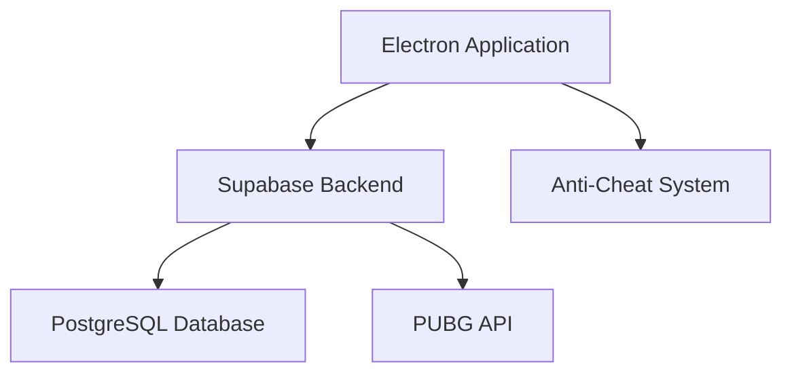

# Technical Requirements Document (TRD)

## 1. Executive Technical Summary
- **프로젝트 개요**: PUBG 플레이어들을 위한 경쟁 플랫폼을 제공하는 데스크톱 애플리케이션을 개발합니다. 이 플랫폼은 PUBG 게임 데이터를 활용하여 다양한 미니 게임 및 챌린지를 통해 사용자 간의 경쟁을 촉진합니다. Electron, TypeScript, React, Tailwind CSS, Shadcn UI, Supabase, Supabase Auth, Supabase Realtime을 사용하여 빠르고 안정적인 개발을 목표로 합니다.
- **핵심 기술 스택**: Electron, TypeScript, React, Tailwind CSS, Shadcn UI, Supabase, Supabase Auth, Supabase Realtime
- **주요 기술 목표**:
    - 성능: 빠른 응답 시간 및 효율적인 리소스 사용
    - 확장성: 증가하는 사용자 및 데이터 양에 대한 대응
    - 안정성: 안정적인 서비스 운영 및 오류 최소화
- **주요 기술 가정**:
    - PUBG API의 안정적인 데이터 제공
    - Electron 환경에서의 데스크톱 애플리케이션 개발의 용이성
    - Supabase의 안정적인 백엔드 서비스 제공

## 2. Tech Stack

| 카테고리         | 기술 / 라이브러리             | 사유 (이 프로젝트에 선택된 이유)                                                                                                                                                                                                                 |
| -------------- | --------------------------- | -------------------------------------------------------------------------------------------------------------------------------------------------------------------------------------------------------------------------------------------------------- |
| 플랫폼         | Electron                      | 크로스 플랫폼 데스크톱 애플리케이션 개발을 위한 최적의 선택. 웹 기술(HTML, CSS, JavaScript)을 사용하여 개발 가능하며, 네이티브 애플리케이션과 유사한 성능과 기능을 제공합니다.                                                                                                             |
| 언어           | TypeScript                    | JavaScript의 슈퍼셋으로, 정적 타입 검사를 통해 코드의 안정성을 높이고 유지보수를 용이하게 합니다. 대규모 프로젝트에 적합하며, 개발 생산성을 향상시킵니다.                                                                                                                            |
| UI 프레임워크    | React                         | 컴포넌트 기반 아키텍처를 통해 UI 개발을 효율적으로 수행할 수 있습니다. 가상 DOM을 사용하여 성능을 최적화하고, 다양한 라이브러리 및 도구와의 통합이 용이합니다.                                                                                                                             |
| 스타일링        | Tailwind CSS                  | 유틸리티 기반 CSS 프레임워크로, 빠른 UI 개발과 일관된 디자인 시스템 구축을 지원합니다. 컴포넌트 재사용성을 높이고, 스타일 충돌 문제를 방지합니다.                                                                                                                                   |
| UI 컴포넌트 라이브러리 | Shadcn UI                     | 재사용 가능한 UI 컴포넌트 세트를 제공하여 개발 속도를 높이고 일관된 사용자 경험을 제공합니다. Tailwind CSS와 호환되어 스타일링을 쉽게 커스터마이징할 수 있습니다.                                                                                                                             |
| 백엔드          | Supabase                      | BaaS(Backend as a Service) 플랫폼으로, 인증, 데이터베이스, 실시간 통신 등 다양한 백엔드 기능을 제공합니다. 서버리스 아키텍처를 통해 인프라 관리를 최소화하고 개발에 집중할 수 있습니다.                                                                                                                    |
| 인증           | Supabase Auth               | 안전하고 간편한 사용자 인증 및 권한 관리를 제공합니다. 소셜 로그인, 이메일/비밀번호 로그인 등 다양한 인증 방식을 지원하며, JWT(JSON Web Token)를 사용하여 사용자 세션을 관리합니다.                                                                                                                 |
| 실시간 통신      | Supabase Realtime             | WebSocket을 기반으로 실시간 데이터 업데이트 및 푸시 알림을 지원합니다. 게임 데이터, 랭킹 업데이트, 알림 등 실시간으로 변경되는 정보를 사용자에게 빠르게 전달할 수 있습니다.                                                                                                                          |

## 3. System Architecture Design

### Top-Level building blocks
- **Electron Application (Frontend)**:
    - 사용자 인터페이스 (UI) 및 사용자 경험 (UX) 제공
    - React 컴포넌트 기반으로 구축
    - Tailwind CSS 및 Shadcn UI를 사용하여 스타일링 및 레이아웃 구성
    - Supabase Realtime을 통해 실시간 데이터 업데이트 처리
- **Supabase Backend**:
    - 데이터베이스 (PostgreSQL)를 사용하여 사용자 데이터, 게임 데이터, 랭킹 정보 저장
    - Supabase Auth를 사용하여 사용자 인증 및 권한 관리
    - Supabase Realtime을 사용하여 실시간 데이터 업데이트 및 푸시 알림 제공
    - PUBG API로부터 게임 데이터 수집 및 처리
- **PUBG API**:
    - PUBG 게임 데이터를 제공
    - 사용자 통계, 매치 결과 등 다양한 정보 제공
    - Supabase Backend에서 API를 호출하여 데이터 수집
- **Anti-Cheat System**:
    - 게임 데이터 분석 및 이상 행위 감지를 통해 부정 행위 방지
    - 사용자 클라이언트에서 실행되는 별도의 모듈로 구현
    - 필요에 따라 서버 측 검증 로직 추가

### Top-Level Component Interaction Diagram



- **Electron Application**: 사용자의 요청을 받아 Supabase Backend로 전달하고, 응답받은 데이터를 UI에 표시합니다. Supabase Realtime을 통해 실시간 데이터 업데이트를 수신합니다.
- **Supabase Backend**: Electron Application으로부터 받은 요청을 처리하고, PostgreSQL Database에 데이터를 저장하거나 PUBG API로부터 게임 데이터를 수집합니다. Anti-Cheat System으로부터 받은 정보를 기반으로 사용자 제재를 수행합니다.
- **PostgreSQL Database**: 사용자 데이터, 게임 데이터, 랭킹 정보 등 플랫폼에서 사용되는 모든 데이터를 저장합니다.
- **PUBG API**: Supabase Backend에 게임 데이터를 제공합니다.

### Code Organization & Convention
**Domain-Driven Organization Strategy**
- **도메인 분리**: 사용자 관리, 게임 관리, 랭킹 관리 등 비즈니스 도메인별로 코드를 분리합니다.
- **계층형 아키텍처**: 프레젠테이션 계층, 비즈니스 로직 계층, 데이터 접근 계층, 인프라 계층으로 분리합니다.
- **기능 기반 모듈**: 관련 기능을 함께 그룹화합니다 (예: 사용자 인증 모듈, 게임 로직 모듈).
- **공유 컴포넌트**: 공통 유틸리티, 타입, 재사용 가능한 컴포넌트를 전용 공유 모듈에 저장합니다.

**Universal File & Folder Structure**
```
/
├── src/
│   ├── components/          # 재사용 가능한 UI 컴포넌트
│   │   ├── common/           # 공통 컴포넌트
│   │   ├── game/             # 게임 관련 컴포넌트
│   │   ├── user/             # 사용자 관련 컴포넌트
│   │   └── ...
│   ├── pages/               # 라우팅되는 페이지 컴포넌트
│   │   ├── home/             # 홈 페이지
│   │   ├── game/             # 게임 페이지
│   │   ├── profile/          # 프로필 페이지
│   │   └── ...
│   ├── services/            # API 호출 및 데이터 처리 로직
│   │   ├── pubgApi.ts        # PUBG API 관련 서비스
│   │   ├── supabase.ts       # Supabase 관련 서비스
│   │   └── ...
│   ├── utils/               # 유틸리티 함수 및 상수
│   │   ├── helpers.ts        # 헬퍼 함수
│   │   ├── constants.ts      # 상수
│   │   └── ...
│   ├── types/               # TypeScript 타입 정의
│   │   ├── game.ts           # 게임 관련 타입
│   │   ├── user.ts           # 사용자 관련 타입
│   │   └── ...
│   ├── App.tsx              # 루트 컴포넌트
│   ├── index.tsx            # 진입점
│   └── ...
├── public/              # 정적 파일 (이미지, 아이콘 등)
├── electron/            # Electron 관련 파일
│   ├── main.ts           # Electron 메인 프로세스
│   ├── preload.ts        # Electron 프리로드 스크립트
│   └── ...
├── package.json           # 프로젝트 설정 파일
├── tsconfig.json        # TypeScript 설정 파일
├── tailwind.config.js   # Tailwind CSS 설정 파일
└── ...
```

### Data Flow & Communication Patterns
- **클라이언트-서버 통신**: API 요청/응답 패턴 (RESTful API)
- **데이터베이스 상호 작용**: Supabase ORM을 사용하여 데이터베이스와 상호 작용
- **외부 서비스 통합**: PUBG API를 사용하여 게임 데이터 수집
- **실시간 통신**: Supabase Realtime을 사용하여 실시간 데이터 업데이트 및 푸시 알림
- **데이터 동기화**: 분산된 컴포넌트 간의 데이터 일관성 유지

## 4. Performance & Optimization Strategy

- **코드 최적화**: 불필요한 렌더링 방지, 메모리 누수 방지, 효율적인 알고리즘 사용
- **이미지 최적화**: 이미지 압축, Lazy Loading을 통해 초기 로딩 속도 향상
- **캐싱**: 자주 사용되는 데이터를 캐싱하여 데이터 접근 속도 향상
- **데이터베이스 쿼리 최적화**: 인덱스 사용, 불필요한 데이터 조회 방지

## 5. Implementation Roadmap & Milestones
### Phase 1: Foundation (MVP 구현)
- **핵심 인프라**: 기본 시스템 설정 및 기반 컴포넌트 구축
    - Electron 프로젝트 설정
    - Supabase 프로젝트 설정 및 데이터베이스 스키마 정의
    - 사용자 인증 시스템 구축 (Supabase Auth)
- **필수 기능**: 최소 실행 가능 제품 기능
    - 사용자 등록, 로그인, 프로필 관리 기능 구현
    - 게임 방 생성 및 참여 기능 구현
    - PUBG API 연동 및 게임 데이터 수집 기능 구현
- **기본 보안**: 기본적인 보안 구현
    - 사용자 비밀번호 암호화
    - API 요청에 대한 인증 및 권한 부여
- **개발 환경 설정**: 개발 환경 및 CI/CD 기본 설정
    - 개발 환경 설정 (Node.js, npm, VS Code)
    - Git 저장소 설정 및 코드 관리
- **타임라인**: 예상 완료 기간 (4주)

### Phase 2: Feature Enhancement
- **고급 기능**: MVP 이상의 확장된 기능
    - 미니 게임 구현 (킬 레이스, 생존 챌린지, 정확도 테스트)
    - 랭킹 시스템 구현
    - 리더보드 구현
    - 매치메이킹 시스템 구현
- **성능 최적화**: 시스템 성능 개선
    - 코드 최적화
    - 이미지 최적화
    - 데이터베이스 쿼리 최적화
- **향상된 보안**: 고급 보안 기능 및 규정 준수
    - 안티 치트 시스템 구현
    - 데이터 보안 강화
- **모니터링 구현**: 종합적인 관찰 가능성 설정
    - 로그 수집 및 분석 시스템 구축
    - 성능 모니터링 시스템 구축
- **타임라인**: 예상 완료 기간 (8주)

## 6. Risk Assessment & Mitigation Strategies
### Technical Risk Analysis
- **기술적 위험**: 잠재적인 기술적 문제 및 복잡성 문제
    - PUBG API의 불안정성
    - Electron 프레임워크의 제한 사항
    - Supabase 서비스의 장애
- **성능 위험**: 확장성 및 성능 병목 현상 문제
    - 대규모 사용자 트래픽 처리
    - 실시간 데이터 처리 성능
- **보안 위험**: 잠재적인 보안 취약점 및 공격 벡터
    - 사용자 데이터 유출
    - 서비스 거부 공격 (DDoS)
    - 게임 클라이언트 변조
- **통합 위험**: 타사 서비스 종속성 및 실패 지점
    - PUBG API 장애
    - Supabase 서비스 장애
- **완화 전략**: 식별된 각 위험을 해결하기 위한 구체적인 접근 방식
    - PUBG API 장애에 대비한 대체 API 사용 또는 데이터 캐싱
    - Electron 프레임워크의 제한 사항을 해결하기 위한 네이티브 모듈 사용
    - Supabase 서비스 장애에 대비한 백업 시스템 구축
    - 대규모 사용자 트래픽 처리를 위한 로드 밸런싱 및 캐싱
    - 실시간 데이터 처리 성능 향상을 위한 코드 최적화 및 분산 처리
    - 사용자 데이터 유출 방지를 위한 데이터 암호화 및 접근 제어
    - 서비스 거부 공격 (DDoS) 방어를 위한 방화벽 및 트래픽 필터링
    - 게임 클라이언트 변조 방지를 위한 안티 치트 시스템 구현

### Project Delivery Risks
- **타임라인 위험**: 개발 일정 문제 및 종속성
    - 개발 일정 지연
    - 리소스 부족
- **리소스 위험**: 팀 역량 및 기술 전문 지식 요구 사항
    - 개발 인력 부족
    - 기술 숙련도 부족
- **품질 위험**: 코드 품질 및 테스트 범위 문제
    - 코드 품질 저하
    - 테스트 부족
- **배포 위험**: 프로덕션 배포 및 환경 문제
    - 배포 환경 문제
    - 배포 실패
- **비상 계획**: 대체 접근 방식 및 백업 전략
    - 개발 일정 지연에 대비한 추가 인력 투입 또는 기능 축소
    - 리소스 부족에 대비한 외부 전문가 활용 또는 교육
    - 코드 품질 저하 방지를 위한 코드 리뷰 및 테스트 강화
    - 배포 환경 문제에 대비한 사전 테스트 및 배포 자동화
